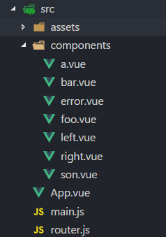

### [vue-router](https://router.vuejs.org/zh-cn/)

### 文件目录



### 开始

#### html基础部分 (app.vue)

```html
<!--展现内容  -->
<router-view></router-view>
<!--内容跳转  -->
<router-link to="/a">a</router-link>
```

#### javascript基础部分 (routes.js)

```javascript
import a from './components/a.vue';
//定义路由的路线
const routes = [
  {
    //路线的url 名字 对应的组件
    path:'/a',
    name:'a',
    component:a
  }
]
export default routes;
```

#### main.js

```javascript
import Vue from 'vue'
import App from './App.vue'
import VueRouter from 'vue-router';
import routes from './router';
//全局注册使用vue-router
Vue.use(VueRouter);
//初始化路由 定义路线
const router = new VueRouter({
  routes:routes
});
//给vue的实例 使用路由
new Vue({
  el: '#app',
  router,
  render: h => h(App)
})
```

