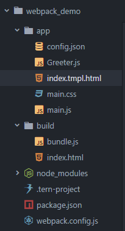

## webpack 学习笔记

### webpack 配置文件 webpack.config.js

- require( ) 引入项目依赖
- module.exports 模板输出
- inport 模板导入
- loader是将各种东西都可以打包成js模板



#### 实例

```javascript
//声明依赖
var webpack = require('webpack');
var HtmlWebpackPlugin = require('html-webpack-plugin');

module.exports = {
    //基础配置 __dirname 项目根目录
    entry:  __dirname + "/app/main.js",//打包 入口文件
    output: {
        path: __dirname + "/build",//打包后 存放的目录名
        filename: "bundle.js"//打包后输出文件名
    },
    // loader配置
    module: {
      loaders: [
        {
            test: /\.json$/, //处理文件的扩展名的正则表达式 必须
            loader: "json-loader" //对应loader插件 必须
        },
        {
            test:/\.css$/,
            loader:'style-loader!css-loader'
        }
      ]
    },
    // 插件使用 new 一个这个插件的实例，并传入相关的参数
    plugins: [
      new HtmlWebpackPlugin({
        template: __dirname + "/app/index.tmpl.html"
      })
    ],

};
```

