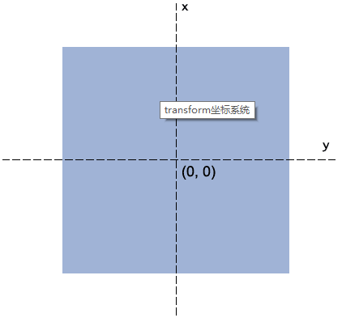

### 参考文章 [阮一峰](http://www.ruanyifeng.com/blog/2014/02/css_transition_and_animation.html) [张老师](http://www.zhangxinxu.com/wordpress/2010/11/css3-transitions-transforms-animation-introduction/)

## transition 过渡

- `transition-property` 过渡的属性名
- `transition-delay` 过渡的时间
- `transition-timing-function` 过渡的速度函数
- `transition-delay` 过渡延迟

### 使用注意

- `transition` 需要知道中间状态的变化 如0px到100px 不能0px到auto，display的block到none
- `transition` 需要事件触发，不能网页加载自动发生

## 动画 animation

- `animation-name` 绑定动画名字
- `animation-duration` 动画持续时间
- `animation-timing-function` 动画速度函数
- `animation-delay` 动画延迟
- `animation-iteration-count` 次数 infinite
- `animation-fill-mode` 动画结束状态
- `animation-direction` 动画方向
- `animation-play-state` 动画暂停和运动 paused running

### 定义

```css
@keyframes item{
  0% {
    background-color: red;
  }
  100% {
    background-color: blue;
  }
}
```

## transform 转换

- 定义让元素2d或3d转换

- 场景元素过渡动画、过渡动画、元素位移、旋转等等

   

### `rotate(angle)`

- 定义2d旋转 单位deg 表示度数 顺时针
- 旋转中心为中心默认

### `transform-origin`

- 定义盒子的圆心坐标 默认为中心